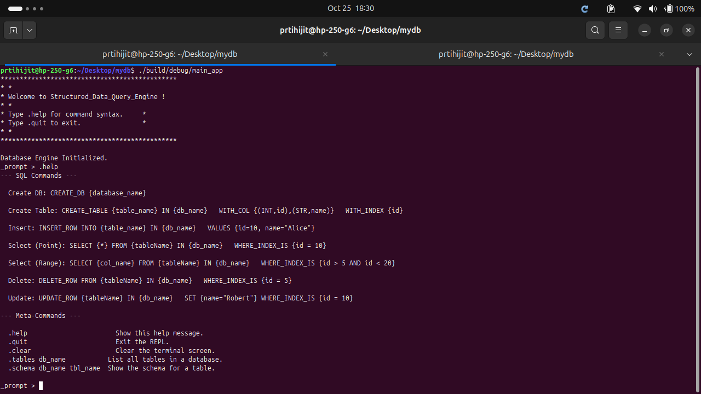
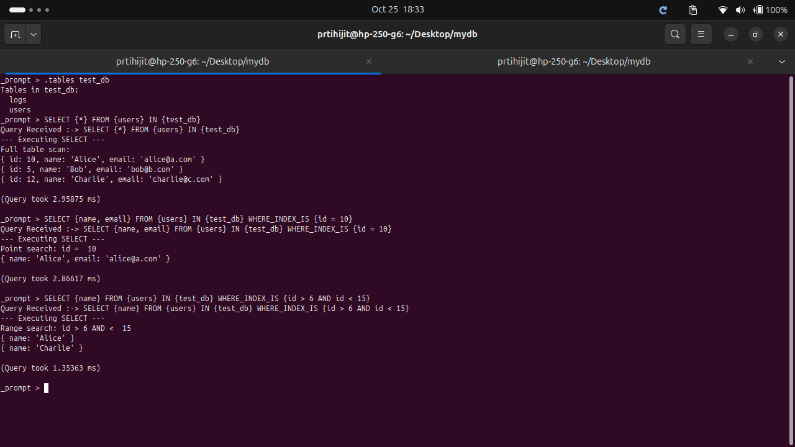
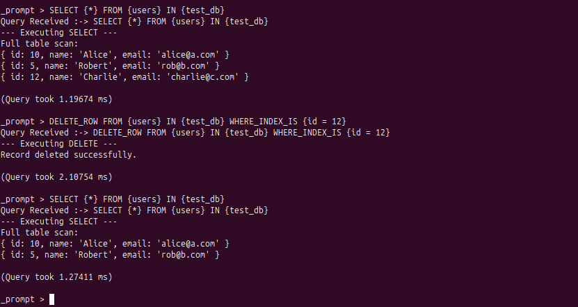
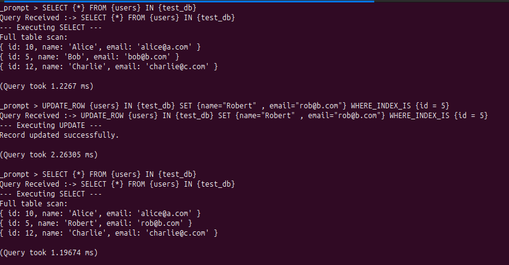

# Structured\_Data\_Query\_Engine

A minimal C++ relational database engine with a custom query language and persistent, disk-based storage.

## About The Project

This project is a single-user, relational data storage engine built from scratch in C++. It is designed to understand the core components of a database, including:

  * A custom indexing engine managing an on-disk B-tree with COW and Free List support
  * A record Manager storing/retriving fixed-length records in an on-disk file
  * A table manager which acts as an interface between the above two
  * A robust, hand-written recursive-descent parser for sql like syntax
  * An execution engine which acts as an interface between table manager and parser
  * An interactive Read-Eval-Print Loop (REPL) interacting with the execution engine.

Clients interact with the engine via a CLI. All data is persisted to disk, with each database as a directory and each table as a set of three files (`.schema`, `.idx`, `.data`).

## Features

  * **Persistent Storage:** Data is saved to disk and persists between sessions.
  * **B-Tree Indexing:** All tables are indexed for fast, B-Tree-based lookups on a primary key.
  * **Custom Query Language:** A simple, SQL-like query language (see syntax below).
  * **Interactive REPL:** A user-friendly REPL for executing queries and managing the database.
  * **Meta-Commands:** REPL-specific commands for inspecting the database, like `.tables` and `.schema`.
  * **Query Timings:** The REPL reports the execution time for every query.
  * **Default Primary Key:** Automatically generates an auto-incrementing `row_num` primary key if one isn't specified.

## Architecture

The engine's storage model is based on a **Heap File** with a **Primary Index**. For each table, three files are created within its database directory:

1.  **`table_name.schema`**: A plain-text metadata file that defines the column names, types (`INT` or `STR`), and which column is the index.
2.  **`table_name.idx`**: A binary **B-Tree** file. This file stores key-value pairs where the **key** is the indexed column's value (e.g., `id=10`) and the **value** is the 32-bit byte offset (the "row pointer") of that record in the `.data` file.
3.  **`table_name.data`**: A binary **Heap File**. This file contains all the actual row data, stored as fixed-length records. New records are simply appended to the end of this file.

## Getting Started

### Prerequisites

  * A C++17 compliant compiler (e.g., g++, clang)
  * The codebase with Makefile
  

### Compilation

Using the provided Makefile

```bash
make BUILD=release ; builds the default target repl exe
make tests ;builds the test folder where each .cpp is made into exe
make libs ; builds each folder under src into an .so
```

### Running the REPL

Execute the compiled binary to start the interactive REPL.

```bash
./build/release/main_app
```

```text
******************************************
* *
* Welcome to Structerd Data Query Engine!
* *
* Type .help for command syntax.       *
* Type .quit to exit.                  *
* *
******************************************

_prompt >
```

## REPL Meta-Commands

These commands are built into the REPL for database management.

  * `.help`: Shows the help message with all available query syntax.
  * `.quit`: Exits the REPL.
  * `.clear`: Clears the terminal screen.
  * `.tables db_name`: Lists all tables in the specified database.
  * `.schema db_name table_name`: Prints the schema for a specific table.



## Query Language Syntax

All queries must follow the syntax below. Keywords are case-sensitive, and values are enclosed in curly braces `{}`.

### Create DB

```sql
CREATE_DB {database_name}
```

### Create Table

The `WITH_INDEX` clause is optional. If not provided, an auto-incrementing `INT` column named `row_num` will be created and set as the index.

```sql
CREATE_TABLE {table_name} IN {db_name} WITH_COL {(INT,id),(STR,name)} WITH_INDEX {id}

-- Example with default index:
CREATE_TABLE {logs} IN {my_db} WITH_COL {(STR,level),(STR,message)}
```

### Insert Row

```sql
INSERT_ROW INTO {table_name} IN {db_name} VALUES {id=10, name="Alice"}
```

### Select (Point)

Supports `*` (all columns) or a comma-separated list of columns.

```sql
SELECT {*} FROM {users} IN {test_db} WHERE_INDEX_IS {id = 10}
SELECT {name, email} FROM {users} IN {test_db} WHERE_INDEX_IS {id = 10}
```

### Select (Range)

Only supported for `INT` index columns.

```sql
SELECT {name} FROM {users} IN {test_db} WHERE_INDEX_IS {id > 5 AND id < 20}
```


### Delete Row

Only supports simple equality checks on the index column.

```sql
DELETE_ROW FROM {users} IN {test_db} WHERE_INDEX_IS {id = 5}
```


### Update Row

Only supports simple equality checks on the index column.

```sql
UPDATE_ROW {users} IN {test_db} SET {name="Robert"} WHERE_INDEX_IS {id = 10}
```


## Limitations

This is an educational engine and has several design limitations:

  * **Data Types:** Only `INT` (stored as `int64_t`) and `STRING` (fixed 255-byte) are supported.
  * **Single User:** The engine has no concept of locking or concurrency control. Running two instances on the same database files *will* lead to corruption.
  * **No Explicit Transactions:** Every query is a single, auto-committed transaction. There is no `START_TRANSACTION`, `COMMIT`, or `ROLLBACK`.
  * **No Joins or Sorting:** Queries can only operate on one table at a time. No `JOIN` or `ORDER BY` clauses are supported.
  * **Query Restrictions:**
      * `DELETE` and `UPDATE` queries *must* use the `WHERE_INDEX_IS` clause with a simple equality check (e.g., `id = 10`).
      * `UPDATE` commands cannot modify the index column (for now - as we have btree upadte api, so in future version we can remove this restriction)
